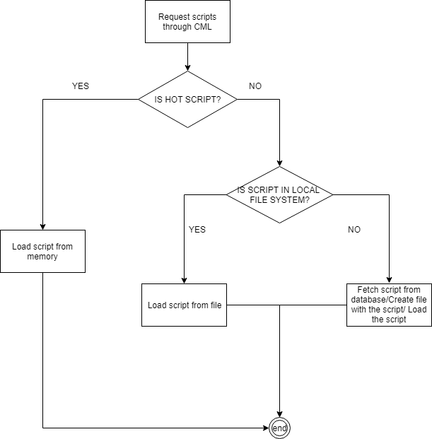

# Cache Manager Library (CML)

This is a library that is used in order to retrieve data from the database, and cache it in order to not have expensive db call.  

For example;  
in the case of the Arena Service ([Battle service](services/Arena_BattleSystem.md#arena)). At the start of a battle, the contenders (monsters) that the player are facing are selected and thus known. The Service will have to fetch how the contenders behaviour are (stats, attacks, artificial intelligence and so on..), this logic is stored as chai scripts in the DB. When the battle end, if necessary, the memory is flushed for the next battle (new contenders / actions to fetch).  
But in case the same contender is selected for the next fight, it would be a waster to retrieve the behaviours twice in the database.  

## To resolve this issue : CML is composed of 3 distincts steps:

-   Retrieve from the database
-   Create a at a specified file system location a folder hierarchy in order to find the contender again if needed.
-   If the scripts is considered as "hot" (often used), it is kept in memory and not flushed at the end of the battle.

Thanks to those 3 steps, in the second attempt to retrieve the contender data. 
1\. First it will be checked if it is a hot scripts (basically contenders are not hot scripts, but actions like attacks are). 
2\. If it is not a hot script, the local file system is checking for the existance of the file that should correspond the script.  
3. If it is found, it will be loaded, otherwise the database is requested.

## Up to date

In order to not have not up to date scripts stored in the file system. Two mecanisms are possible:

-   Cleanup of the script at back-end startup (to enforce new database fetch)
-   Redownload from database of the scripts stored on the file system at the back-end startup (to ensure up to date data).
